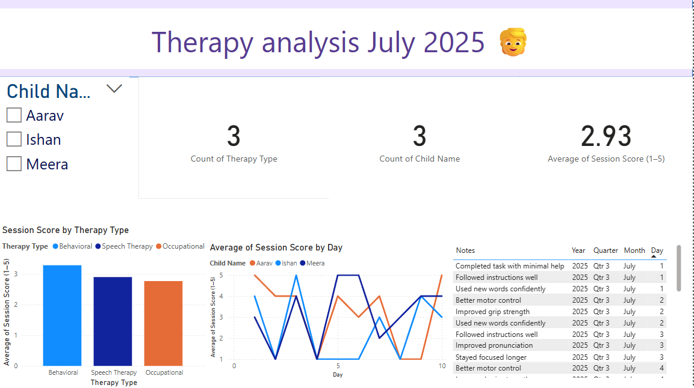

# Therapy Progress Dashboard
A Power BI dashboard to track therapy sessions and child progress using fake data.

This project tracks:
- Session score across therapy types
- Progress by child over time
- Notes by the therapists
  
## Tools used-
- Microsoft Power BI

## Purpose
To build a portfolio project focused on education and healthcare analytics.  

## Preview

*Built with love & curiosity to support children through data.* 🧒

